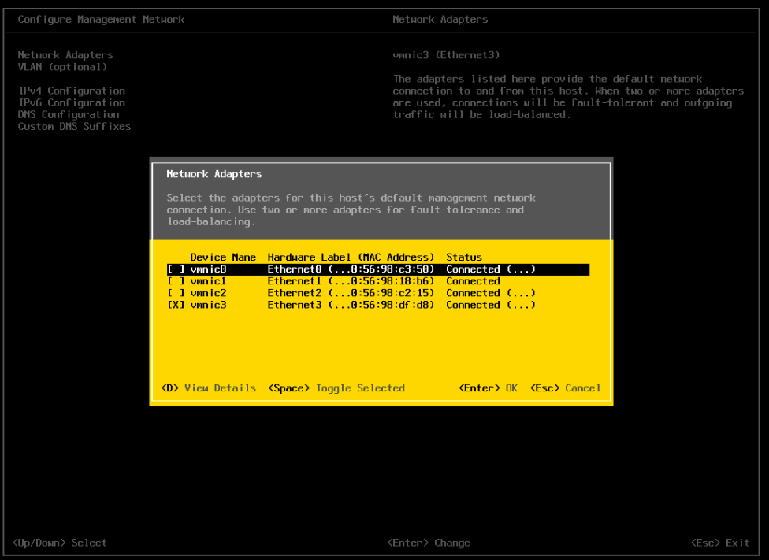

# Projet Virtualisation et Cloud - Groupe 09

## Membres du groupe

- DUVEAU Pierre
- MEUNIER Paul
- NICOLE Clément
- PRATOUSSY Martin


## SOMMAIRE
-   [Définitions](#definitions)
-   [Découpage Réseau / sous-réseau et IP](#IP)
-   [Se connecter à vCenter](#connect)
-   [Intallation d'un ESXi](#esxi)
-   [Installation du Contrôleur de Domaine](#dc)
-   [Installation des Utilisateurs (1, 2, 3)](#users)
-   [vCenter](#vcenter)

## Définitions <a name="definitions"></a>

- **ESXi** VMware ESXi est un hyperviseur de type entreprise de type 1 développé par VMware pour déployer et servir des ordinateurs virtuels.
- **CD** Un serveur informatique hébergeant l'annuaire Active Directory est appelé « contrôleur de domaine ». Active Directory stocke ses informations et paramètres dans une base de données distribuée sur un ou plusieurs contrôleurs de domaine, la réplication étant prise en charge nativement.
- **vSPhere** VMware vSphere est un logiciel d'infrastructure de Cloud computing de l'éditeur VMware. C'est un hyperviseur de type 1, basé sur l’architecture VMware ESXi. VMware vSphere nécessite une configuration matérielle restreinte précisée dans le guide de compatibilité VMware.
- **vCenter** vCenter Server est l'utilitaire de gestion centralisée pour VMware et est utilisé pour gérer les machines virtuelles, plusieurs hôtes ESXi et tous les composants dépendants à partir d'un emplacement centralisé unique.
- **NAS** Un serveur de stockage en réseau, également appelé stockage en réseau NAS, boîtier de stockage en réseau ou plus simplement NAS, est un serveur de fichiers autonome, relié à un réseau, dont la principale fonction est le stockage de données en un volume centralisé pour des clients réseau hétérogènes.
- **SAN** En informatique, un réseau de stockage, ou SAN, est un réseau spécialisé permettant de mutualiser des ressources de stockage.

## Découpage Réseau / sous-réseau et IP <a name="IP"></a>

D'après le schéma fournit par nos enseignants, nous savons que notre plage d'adresses IP en Management va de `192.168.17.144` à `192.168.17.159`, et que notre découpage IP se doit d'être similaire au schéma ci-dessous :


Nous avons donc défini le découpage suivant :

Management :bookmark_tabs: :

```txt
dc : 192.168.17.146 /24
vcsa : 192.168.17.147 /24
esxi01 : 192.168.17.148 /24
esxi02 : 192.168.17.149 /24
esxi03 : 192.168.17.150 /24
freenas : 192.168.17.151 /24
```

Prod :desktop_computer: :

````
dc : 10.20.30.1 /24
user01 : 10.20.30.2 /24
user02 : 10.20.30.3 /24
user03 : 10.20.30.4 / 24
```txt

Stockage :floppy_disk: :
```txt
esxi01 : 172.16.0.2 /24
esxi02 : 172.16.0.3 /24
esxi03 : 172.16.0.4 /24
freenas : 172.16.0.5 /24
````

vMotion  :inbox_tray: :

```txt
esxi01 : 10.50.100.2 /24
esxi02 : 10.50.100.3 /24
esxi03 : 10.50.100.4 /24

```

vSwitch :

```
VMnic0 : (Interface) pour le management (1 Vswitch)
VMnic1 : (Interface) pour la prod (1 autre Vswitch)
VMnic2 : pour ISCSI (1 autre autre Vswitch)
VMnic3 : pour vMotion (1 autre autre autre Vswitch)
```

## Se connecter à vCenter <a name="connect"></a>

Pour se connecter au vCenter de l'école, nous avons besoin d'un VPN.

Il vous faut installer OpenVPN :

- Ubuntu : `apt-get install openvpn`
- Windows : [Télécharger OpenVPN](https://openvpn.net/client-connect-vpn-for-windows/)

Une fois installé, vous allez devoir le configurer. Pour se faire, vous allez devoir télécharger le fichier OpenVPN founit par vos enseignants :

Votre VPN devrait ressembler à ça :
> Choisissez OpenVPN


> Renseignez votre nom d'utilisateur ainsi que votre mot de passe CPE


Pour mettre en place une redirection DNS :

- Effectuez la commande suivante dans un shell : `sudo nano /etc/hosts`
- Puis renseignez votre redirection DNS :
```bash
192.168.16.10   vcenter.tpv.cpe.localdomain
```

Renseignez dans l'URL : `http://vcenter.tpv.cpe.localdomain`

Nom d'utilisateur : `virtu-09@tpv.cpe.localdomain`
Mot de passe : `cf. l'excel fournit par vos enseignants`

## Intallation d'un ESXi <a name="esxi"></a>

### Création de l'ESXi

Cette manipulation est à effectuer sur le vCenter (si vous n'êtes pas connecté sur le vCenter, merci de regarder le point ci-dessus)

> Faire un clic droit sur votre groupe -> 'Nouvelle machine virtuelle'

> Choisir là où va se créer la VM, ainsi que son nom :
> 

> Choisir son cluster :
> 

> Choisir l'emplacement de stockage de votre ESXi :
> 

> Choisir la compatibilité de votre ESXi :
> 

> Choisir le type de machine virtuelle que l'on veut créer (`ESXi 7.0 or later` dans notre cas) :
> 

> Configurer les différents réseaux et le stockage disque
>
> :warning: bien mettre le disque en mode `Thin Provision | Provisionnement Dynamique`
> 
> 

### Paramétrage de l'ESXi :

> Vous devrez vous identifier sur l'ESXi (root / Vmware1!)
> 

> On va ensuite configurer l'adaptateur réseau que l'on souhaite utiliser
> 
> 

> On va définir notre @IP, notre Masque et notre Passerelle par défaut
> 


## Installation du Contrôleur de Domaine <a name="dc"></a>
Le contrôleur de domaine aura pour rôle sur notre réseau de distribuer les différentes @IP distribuées en DHCP aux différents *"users"*, et d'installer le `VCSA` sur l'ESXi de notre choix.


### Création du DC
> Une fois connecté sur votre ESXi, clic droit sur le menu `Machines virtuelles` -> `Créer/Enregister une VM`

>Choisir le nom de la machine ainsi que l'OS à implémenter :
>

> Choisir l'endroit où l'on va stocker notre DC :
>

> Ajouter les adaptateurs réseau pour qu'il puisse être connecté aux différents réseaux (Prod, Management, Stockage et vMotion)
>


### Paramétrage effectué par la suite :

```
- Création d'un Active Directory (Nom : Gr9.dom)
- Création de zone DNS (Zone de recherche direct et zone de recherche inversée) pour les ESXi, vCenter, DC, sur le réseau management
- Création de zone DNS dynamique pour le réseau de production
- Création d'un pool DHCP pour le réseau de production
- Création de la table de routage et de traduction NAT pour le réseau de production
```

## Installation des Utilisateurs (1, 2, 3) <a name="users"></a>

Suivant le schéma fournit par nos enseignants, nous avons installé les VMs correspondantes aux utilisateurs :
- user01 : windows
- user02 : windows
- user03 : linux (ubuntu)

L'installation est similaire à celle du DC, mais au lieu de sélectionner une image serveur, nous utiliserons une image classique.

Grâce au DC, nos utilisateurs peuvent recevoir une adresse IP dynamique en fonction d'une plage prédéfinie, peut importe l'ESXi sur lequel ils se trouvent.

## vCenter <a name="vcenter"></a>

Notre groupe a mit beaucoup de temps à atteindre cette étape, et pour cause : nous sommes 4 élèves issus d'un BTS tourné principalement vers le développement (SIO option SLAM et SNIR). Nous n'avions que de faibles bases en virtualisation, il fût donc plus compliqué pour nous d'arriver jusque là.

De plus, nous avons essayé d'installer `VCSA` (ou vCenter) à plusieurs reprises, mais les machines que nos enseignants nous on fournit n'avaient plus d'espace disque (- 100Go chacune), or il faut un minimum de 150Go pour passer la première étape d'installation du `VCSA`.

Nous nous sommes donc retrouvés dans une impasse, car nous n'avons pas pu avancer plus. Nous avons donc dû rendre un compte rendu très pauvre à cause de la limitation technique qui nous a été imposée.

Nous espérons que cet incident (défaut de stockage), qui nous a empêché de travailler sur les dernières séances et à la maison, ne portera pas préjudice à notre note, car nous avons été défavorisé face aux autres groupes qui ont dû occuper un espace de stockage plus important, nous empêchant alors de progresser davantage.
